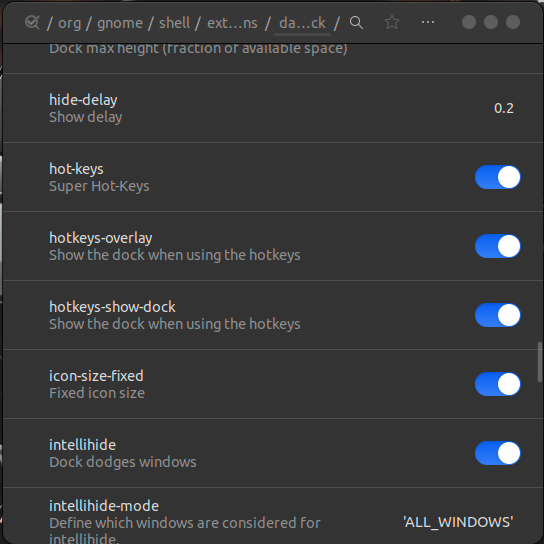

# Configuración inicial de mi escritorio en Ubuntu


## Instalaciones

1. [Chrome](https://www.google.com/chrome/)
2. [VsCode](https://code.visualstudio.com/Download)
3. [Gnome Shell ](https://websetnet.net/es/how-to-use-gnome-shell-extensions-complete-guide/)
4. [Editor dconf ](https://ubuntu.pkgs.org/20.04/ubuntu-universe-amd64/dconf-editor_3.36.0-1_amd64.deb.html)
5. git `sudo apt-get install git`

Configuracion git

```
git config --global user.name "<Your-Full-Name>"
```

```
git config --global user.email "<your-email-address>"
```

Luego configurar git a SSH

## Extensiones Gnome Shell

Abrir extension Genome Shell en Chrome, luego agregar las extensiones:

1. [Desktop Icons](https://extensions.gnome.org/extension/1465/desktop-icons/) `on | configurar para ocultarlos`
2. [Install Hide Top Bar](https://extensions.gnome.org/extension/545/hide-top-bar/) `on`
3. [Install User Themes](https://extensions.gnome.org/extension/19/user-themes/) `on`
4. [Install Transparent TopBar](https://extensions.gnome.org/extension/1765/transparent-topbar/) `on`

Dejar esta misma configuración:


## Cambiar el Tema de Ubuntu

[Video Guiá Para Cambiar el tema de Ubuntu a BigSur](https://www.youtube.com/watch?v=uv1sgAGGLM8&list=LL&index=18&t=314s)

**1.** [Tema WhiteSur GitHub](https://github.com/vinceliuice/WhiteSur-gtk-theme)

-  Clonar repositorio del tema con github en descargas:

```
git clone https://github.com/vinceliuice/WhiteSur-gtk-theme.git
```

-  Entrar a la carpeta WhiteSur-gtk-theme para ejecutar comando en la terminal e instalarlo:

En este comando `-i ubuntu ` es para cambiar el icono del menu de apple por el de ubuntu

```
sudo ./install.sh -i ubuntu
```

Ejecutar el siguiente comando para instalar el GDM Tema para la pantalla del login, siempre dentro de la carpeta WhiteSur-gtk-theme

```
sudo ./tweaks.sh -g
```

**2.** [Iconos WhiteSur GitHub](https://github.com/vinceliuice/WhiteSur-icon-theme)

-  Clonar el repositorio de iconos desde GitHub en descargas:

```
git clone https://github.com/vinceliuice/WhiteSur-icon-theme.git
```

-  Ubicarse en la carpeta WhiteSur-icon-theme desde la terminal para instalar el tema de iconos:

```
sudo ./install.sh -b
```

En el comando `-b` es para la fuente de los iconos en bold

**3.** [Cursores WhiteSur GitHub](https://github.com/vinceliuice/WhiteSur-cursors)

-  Clonar el repositorio de cursores en Descargas:

```
git clone https://github.com/vinceliuice/WhiteSur-cursors.git
```

-  Ubicarse dentro de la carpeta WhiteSur-cursors en la terminal para instalarlo:

```
sudo ./install.sh
```

**4. Una vez clonados los repositorios e instalados los temas hay que aplicar los temas al sistema**

-  Abrir la aplicación de `retoques` y ubicarse en `apariencia`, también asegurarse de que en la aplicación`configuración` `apariencia` este configurado como aparece en la imagen:


## Configurar el Dock de Ubuntu

Abrir la aplicación editor `deconf` y ubicarse en la siguiente carpeta para configurar:

```
/org/gnome/shell/extensions/dash-to-dock
```

Ahora dejar la configuración como esta en las imágenes





## Configurar la Terminal

[Video guia para la configuracion](https://www.youtube.com/watch?v=35EN3iP1-8c&list=LL&index=2&t=944s)

-  Instalar zsh

```
sudo apt-get install zsh
```

-  [Linnk oh-my-zsh](https://ohmyz.sh/)

-  Abrir archivo de configuracion en vscode

```
code .zshrc
```

-  Tema para la terminal `amuse`
-  Fuente para oh-my-zsh [fuente](https://github.com/powerline/fonts)

```
sudo apt-get install fonts-powerline
```

-  Instalación adicional `Tmux` para dividir la terminal

[link tmux comandos](https://www.blog.binaria.uno/2020/05/29/como-usar-tmux-en-linux-y-por-que-es-mejor-que-screen/)

## Instalaciones Adicionales

**1.** [Ulauncher](https://ulauncher.io/) lanzador de aplicaciones

-  [Link de descarga](https://ulauncher.io/#Download)
-  [Link del Tema usado](https://github.com/Surendrajat/SeaOwl-Ulauncher-theme)

```
mkdir -p ~/.config/ulauncher/user-themes
git clone https://github.com/Surendrajat/SeaOwl-Ulauncher-theme \
  ~/.config/ulauncher/user-themes/SeaOwl
```

-  Configurar `Preferencias` para que arranque siempre al iniciar sesión `Launch at Login`

**2.** Instalar Teams

-  [Link de descarga](https://www.microsoft.com/es-co/microsoft-teams/download-app#desktopAppDownloadregion)
-  [Instalar](https://platzi.com/tutoriales/1905-microsoft-teams/6632-como-instalar-microsoft-teams-en-ubuntu-linux/)

```
sudo apt -f install ./teams_1.3.00.16851_amd64.deb -y
```

**3.** [Ksnip](https://snapcraft.io/ksnip) para capturas de pantalla y editarlas

## Imagenes para el fondo de pantalla

En la carpeta `Images` se encuentra otra carpeta `Wallpapers` para el fondo de pantalla
